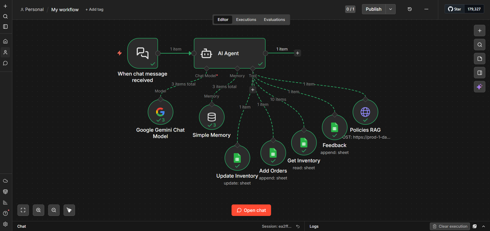

# 🍽️ LiMi Restaurant — AI Customer Support Agent

<div align="center">


**A fully automated AI-powered customer support agent for LiMi Restaurant — built with n8n and Google Gemini. It handles orders, manages inventory, collects feedback, applies discount coupons, and answers policy questions using RAG — all through a chat interface, with zero human intervention.**

</div>

---

## 📌 Table of Contents

- [Overview](#-overview)
- [Features](#-features)
- [Tech Stack](#-tech-stack)
- [Workflow Architecture](#-workflow-architecture)
- [Agent Tools](#-agent-tools)
- [How It Works](#-how-it-works)
- [Google Sheets Structure](#-google-sheets-structure)
- [Setup & Installation](#-setup--installation)
- [Project Structure](#-project-structure)
- [Screenshots](#-screenshots)
- [License](#-license)

---

## 📖 Overview

**LiMi Restaurant AI Agent** is a conversational AI system built on **n8n** that acts as a fully autonomous customer support representative for a restaurant. Powered by **Google Gemini**, it can take orders, check inventory in real-time, log feedback, resolve complaints with discount coupons, and answer restaurant policy queries using **Retrieval-Augmented Generation (RAG)** via Pinecone.

All data — orders, inventory, and feedback — is stored and managed in a **Google Sheets Master Dashboard**, making it easy for restaurant staff to track everything without touching a single line of code.

---

## ✨ Features

- 💬 **Chat-based Interface** — Customers interact via n8n's built-in chat UI
- 🧠 **Google Gemini LLM** — Understands natural language, classifies intent, generates responses
- 🛒 **Order Management** — Takes orders and logs them directly to Google Sheets
- 📦 **Real-time Inventory Check** — Fetches live stock before confirming any order
- 🔄 **Auto Inventory Update** — Deducts stock automatically after every order
- 😊 **Feedback Handling** — Logs complaints & appreciations with Category (Positive/Negative) and Resolution
- 🎟️ **Smart Discount Coupons** — 10% off for complaints, 5% off for appreciation — automatically offered
- 📋 **Menu Display** — Shows food items and prices in a clean table (stock hidden from customers)
- 🔍 **Policy RAG** — Answers restaurant policy questions using Pinecone vector search + GPT-4o
- 🧠 **Conversation Memory** — Remembers context within a session using buffer window memory
- 🚫 **Out-of-Stock Handling** — Politely informs customer and suggests Chef's Special Masala Dosa

---

## 🛠️ Tech Stack

| Tool | Purpose |
|------|---------|
| [n8n](https://n8n.io/) | Workflow orchestration & automation |
| [Google Gemini (PaLM)](https://ai.google.dev/) | Core LLM for chat & reasoning |
| [Pinecone](https://www.pinecone.io/) | Vector DB for RAG-based policy Q&A |
| [GPT-4o](https://openai.com/) | Powers the Pinecone RAG assistant |
| [Google Sheets](https://sheets.google.com/) | Master dashboard — Orders, Inventory, Feedback |
| n8n Memory Buffer Window | Session-level conversation memory |

---

## 🏗️ Workflow Architecture

```
Customer Chat Message
        │
        ▼
  Chat Trigger (n8n)
        │
        ▼
┌──────────────────────────────────┐
│      AI Agent (Google Gemini)     │
│   + Simple Memory (Buffer)        │
└────────────┬─────────────────────┘
             │
    ┌────────┴─────────────────────────────┐
    │          AI Tools Available           │
    ├───────────────────────────────────────┤
    │  🛒 Add Orders       → Google Sheets  │
    │  🔄 Update Inventory → Google Sheets  │
    │  📦 Get Inventory    → Google Sheets  │
    │  💬 Add Feedback     → Google Sheets  │
    │  🔍 Policies RAG     → Pinecone API   │
    └───────────────────────────────────────┘
```

---

## 🧰 Agent Tools

| Tool | Type | Description |
|------|------|-------------|
| **Add Orders** | Google Sheets (Append) | Logs customer Name, Item, and Quantity to the Orders sheet |
| **Update Inventory** | Google Sheets (Update) | Reduces stock count after an order is placed |
| **Get Inventory** | Google Sheets (Read) | Fetches latest menu items, prices, and stock levels |
| **Add Feedback** | Google Sheets (Append) | Logs feedback with Name, Category, Feedback text, and Resolution |
| **Policies RAG** | HTTP Request → Pinecone | Answers policy questions using RAG powered by GPT-4o |

---

## ⚙️ How It Works

### 🛒 Ordering Flow
1. Customer asks to order a food item via chat
2. Agent fetches inventory to check live availability
3. If in stock → logs order to **Orders sheet** → requests payment at `yp@upi`
4. Agent automatically deducts ordered quantity from **Inventory sheet**
5. If out of stock → politely informs and suggests **Chef's Special Masala Dosa**

### 💬 Feedback & Complaint Flow
1. Customer sends a complaint or appreciation message
2. Agent detects intent and responds:
   - **Complaint** → Apologizes + offers **10% discount coupon**
   - **Appreciation** → Thanks customer + offers **5% discount coupon**
3. Logs to **Feedback sheet**: Name, Category (Positive/Negative), Feedback, Resolution

### 📋 Menu Query
1. Customer asks for the menu
2. Agent fetches inventory and displays **Food Item + Price** as a formatted table
3. Stock quantities are hidden from the customer

### 🔍 Policy Questions
1. Customer asks about restaurant policies (refunds, timings, etc.)
2. Agent calls the **Policies RAG** tool → queries the Pinecone `limi` assistant via HTTP
3. Returns accurate answers sourced from the restaurant's policy documents

---

## 📊 Google Sheets Structure

**Master Dashboard:** `LiMi Master Dashboard`

### Sheet 1 — Inventory
| Food Item | Price | Stock |
|-----------|-------|-------|
| Masala Dosa | ₹120 | 15 |
| Veg Sandwich | ₹80 | 10 |
| ... | ... | ... |

### Sheet 2 — Orders
| Name | Item | Quantity |
|------|------|----------|
| Rahul | Masala Dosa | 2 |
| ... | ... | ... |

### Sheet 3 — Feedback
| Name | Feedback | Category | Resolution |
|------|----------|----------|------------|
| Priya | Food was cold | Negative | Apologized + 10% coupon offered |
| ... | ... | ... | ... |

---

## 🚀 Setup & Installation

### Prerequisites

- [n8n](https://docs.n8n.io/getting-started/installation/) (self-hosted or cloud)
- Google Gemini API Key — [Get here](https://ai.google.dev/)
- Google Sheets set up with the 3-sheet structure above
- Google Sheets OAuth2 credentials configured in n8n
- Pinecone account with an assistant named `limi` — [Get here](https://www.pinecone.io/)

### Steps

1. **Clone this repository**
   ```bash
   git clone https://github.com/YashPatel25/n8n-ai-customer-support-agent.git
   cd n8n-ai-customer-support-agent
   ```

2. **Import the workflow into n8n**
   - Open your n8n instance
   - Go to **Workflows** → **Import from File**
   - Upload `My_workflow.json`

3. **Configure credentials in n8n**
   - Add **Google Gemini (PaLM) API** credentials
   - Add **Google Sheets OAuth2** credentials
   - Update the **Pinecone API Key** in the `Policies RAG` HTTP Request node

4. **Update Google Sheet IDs**
   - In the Google Sheets nodes, replace the `documentId` with your own Sheet ID
   - (Found in your Google Sheet URL: `docs.google.com/spreadsheets/d/YOUR_SHEET_ID/`)

5. **Activate the Workflow**
   - Toggle the workflow to **Active**
   - Open the chat interface via the Chat Trigger node URL

6. **Test it!**

   Try these sample messages:
   ```
   "Show me the menu"
   "I want to order 2 Masala Dosa, my name is Rahul"
   "The food was cold and I'm really disappointed"
   "The biryani was amazing! My name is Priya"
   "What is your refund policy?"
   ```

---

## 📁 Project Structure

```
n8n-ai-customer-support-agent/
│
├── My_workflow.json         # n8n workflow export — import this into n8n
├── screenshots/             # Workflow canvas screenshots
│   └── workflow-overview.png
├── README.md                # Project documentation
└── LICENSE                  # MIT License
```

---

## 📸 Screenshots

> *(Add a screenshot of your n8n workflow canvas here)*



---

## 📄 License

This project is licensed under the **MIT License** — see the [LICENSE](LICENSE) file for details.

---

<div align="center">

Built with ❤️ using [n8n](https://n8n.io/) · Google Gemini · Pinecone · Google Sheets

⭐ **If you found this useful, please star the repo!** ⭐

</div>
